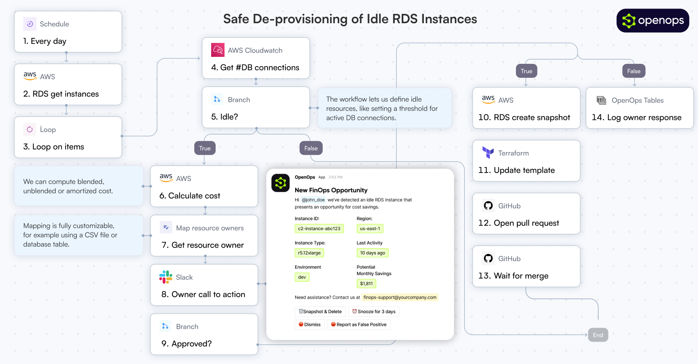

# **OpenOps (Beta)**

 

## **😎 What is OpenOps?**
[OpenOps](https://openops.com) is a **No-Code FinOps automation platform** that helps organizations reduce cloud costs and streamline financial operations.

It provides **customizable workflows** to automate key FinOps processes like allocation, unit economics, anomaly management, workload optimization, safe de-provisioning and much, much more. 

It also comes bundled with its own Excel-like database ([**OpenOps Tables**](https://docs.openops.com/reporting-analytics/tables)) and its own visualization system ([**OpenOps Analytics**](https://docs.openops.com/reporting-analytics/data-visualization)).

At the same time, OpenOps enables collaboration between **FinOps teams, engineers, DevOps, finance, and leadership**, ensuring that cost-saving measures are not just identified but effectively implemented.

OpenOps **integrates seamlessly** with major cloud providers, many third-party FinOps tools, varoious communication platforms and a handful of project management tools.

> 🏁 Just want to get started? [Click here](https://docs.openops.com/getting-started/quick-start-guide).

## **🚀 Key Features**

* **Pre-Built FinOps Workflows** – A library of best-practice workflows designed with input from FinOps leaders. Covers cost optimization, tagging, budgeting, allocation, and reporting.
* **No-Code Experience** – Approachable for non-technical practitioners, but allows "dropping into" code when needed.
* **Flexible Workflow Editor** – Use OpenOps's dedicated No-Code editor to build workflows from scratch or customize existing ones.
* **Deep Integrations** – OpenOps natively connects with cloud providers, databases, analysis tools, communication platforms, and project management systems.
* **Human-in-the-Loop Controls** – OpenOps comes with HITL controls - across multiple channels - for critical approval workflows.
* **Workflow Versioning & Traceability** – Test workflow steps, maintain workflow versions, and track every action inside a workflow with logs.
* **Centralized Management** – Log and process opportunities with tables that allow approvals, dismissals, false-positive marking, and snoozing.

## **🌟 Why OpenOps?**

FinOps practitioners struggle with **visibility tools** that surface cost-saving opportunities but lack implementation capabilities. Traditional automation tools, whether **custom-built** or **off-the-shelf**, fail to balance flexibility and maintainability.

OpenOps solves these challenges by:

* **Consolidating** optimization opportunities from native and third-party FinOps visibility tools.
* **Suggesting** practical optimization actions.
* **Enabling customization** of pre-built optimizations or authoring new ones.

With OpenOps, organizations can automate cloud cost optimization, ensuring that FinOps processes are efficient, actionable, and aligned with business goals.

OpenOps integrates with a broad range of platforms, including cloud providers, databases, FinOps tools, communication platforms, and task management services.

### **⛅️ Cloud Providers**

* AWS
* Azure
* Google Cloud (Coming soon\!)

### **⚙️ System Requirements**

OpenOps is available as:

* A managed cloud service ([learn more](https://openops.com/pricing))
  * No infrastructure requirements
  * Automatic updates and maintenance
  * Premium support and SLAs
* A free, ready-to-install, `docker-compose`-based installation (can be installed locally or in the cloud)

## **📚 Documentation**

For detailed documentation, visit our [documentation portal](https://openops.com/docs).

* [Getting Started Guide](https://docs.openops.com/getting-started/quick-start-guide)
* [Workflow Templates & Management](https://docs.openops.com/workflow-management/workflow-templates)
* Integration Setup // TODO: Add links
* Reporting & Analytics // TODO: Add links

## **🤝 Contributing**

We welcome contributions to OpenOps\! See our [contributing guide](./CONTRIBUTING.md) for details. // TODO: Add CONTRIBUTING.md and link

## **📄 License**

OpenOps is licensed under the **Apache License 2.0**. //TODO: Do we need to configure the repo with the apache license / add the license to the repo

## **💬 Community**

OpenOps has a Slack community - feel free to join [here](https://slack.openops.com).

## **📬 Contact**

* Website: [https://openops.com](https://openops.com)
* Email: [support@openops.com](mailto:support@openops.com)
